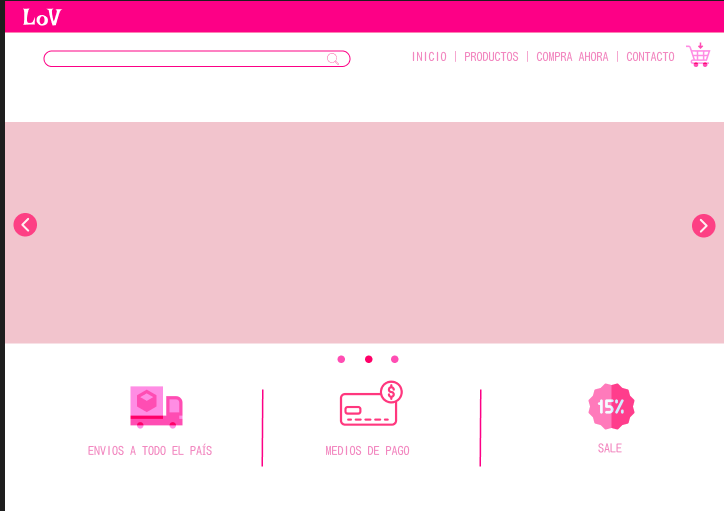
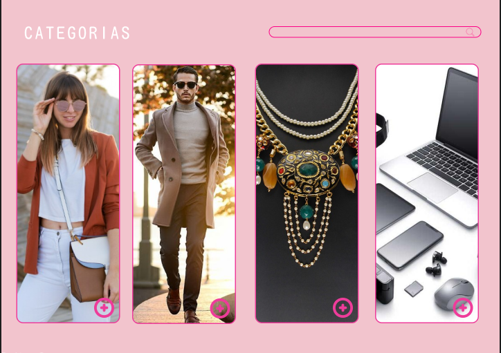
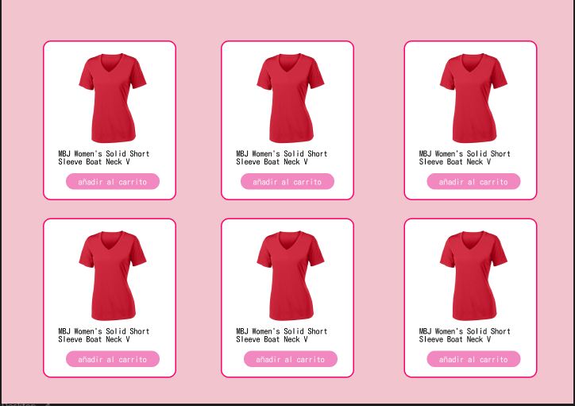

# Proyecto LoV - Análisis de Diseño y Experiencia de Usuario

Esta es la primera maquetación del proyecto de FakeStore, Lov. Busca mostrar una idea de lo que seran las vistas que podrán verse en el proyecto finalizado.

## Vista Principal
En la vista principal, podemos ver una barra con el color caracteristico de la marca, en donde se contiene el logo de la misma.
Justo después vemos un navbar con una barra de busqeda para filtrar, botones de direccionamiento que van a las distintas secciones de la página y un boton que despliega al carrito.
También se encuentra un baner tipo slide que motrará seccion de bienvenida a la tienda virtual, descuentos disponibles y otras publicidades del proyecto, además cuenta con una sección inferior que contiene mas información de la marca.

## Vista Categorias

La vista de categorias cuenta con una barra de busqueda para filtrar los productos por nombre y tres botones que redirigen a las categorias de los productos. (Women's clothing, Men's clothing, Jewerely, Electronics.)

## Vista General productos

Esta vista permite observar todos los productos almacenados en tarjetas. Estas tarjetas contienen el nombre del producto, la imagen del producto y el precio, además de un botón que permite agregar el producto al carrito.

## Vista Detalle producto

En esta vista se busca mostrar mucho más a detalle el producto, en dónde se encontrará una tarjeta que almacena el nombre, la imagen del producto, su descripción y un botón para añadir el producto al carrito.y

## 🎨 Decisiones de Diseño

- Se seleccionó una paleta de colores centrada en tonos rosados para dar una imagen cálida y femenina:
  - Persian Pink (#F288C0)
  - Rose (#FD0086)
  - Pink (#FFC0CB)
  - Blanco (#ffffff)
  - Gris para contraste

- El logo de la tienda es circular, con ícono de corazón o bolsa de compras, y fondo transparente.

- El diseño tiene un enfoque limpio y visual, usando tarjetas de producto con imágenes grandes y tipografía clara.

## 🧭 Experiencia de Usuario

- La navegación está organizada con categorías visibles y botón de carrito siempre accesible.
- El proceso de compra incluye un botón de “Finalizar compra” que muestra un resumen en un modal emergente antes de redirigir a la página de agradecimiento.
- La tienda es **responsive**, optimizada para móviles, tablets y escritorio.
